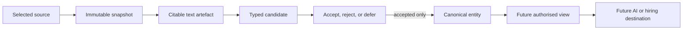

# Why Hire Me

**Why Hire Me helps people build a private, evidence-backed picture of their career that AI can explore for deeper, fairer, asynchronous hiring.**

Bring together real examples of experience, strengths, contributions, and growth. AI can help turn
that evidence into connected knowledge and ask thoughtful follow-up questions. You review what it
proposes and decide what becomes trusted knowledge or leaves your computer.

The project is generic across professions. Source-code inspection is one possible input, not an
assumption about the person or their role.

## What works today

The current command-line workflow can:

1. create a local person profile;
2. capture one explicitly selected file as an immutable SHA-256 snapshot;
3. extract deterministic text from UTF-8 `.txt`, `.md`, and `.markdown` files;
4. cite the extracted text by one-based line range;
5. stage typed entity proposals for human review; and
6. accept, reject, or defer a proposal with an auditable reason.

Supported entity types are `Person`, `Organisation`, `Engagement`, `Role`, `Work`, `Contribution`,
`Artefact`, `Technology`, `TechnologyUse`, and `Credential`.

Only an accepted proposal becomes a canonical entity. Staged, rejected, and deferred proposals
cannot merge identities, run instructions, influence an evaluation, or publish themselves. PDF,
DOCX, OCR, automatic AI extraction, claims, querying, knowledge releases, GitHub delivery, and
NotebookLM delivery are not implemented yet.



## Install the AI skills

You do not need to clone this repository. With Node.js 22.20 or newer installed, run one command:

```sh
npx skills add rajanrx/why-hire-me --skill '*' -g
```

Choose your AI application when asked, then restart it. Native plugin hosts expose the skills under
the plugin namespace:

- `why-hire-me:daily-work-diary` helps you privately reflect on what you achieved and learnt today;
- `why-hire-me:evidence-led-interviewer` explores career evidence and asks useful follow-up
  questions.

Portable skill-only hosts may show the same capabilities without the `why-hire-me:` prefix. The
prefix is supplied by the plugin host; it is deliberately not embedded in each portable skill's
name.

The open Skills installer supports Codex, Claude Code, Gemini CLI, Qwen Code, and many other agent
applications. It installs from this public repository and lets you choose the compatible host on
your computer.

These skills guide AI conversations. They do not yet install the local knowledge runtime. ChatGPT,
the OpenAI API, Claude web, Gemini web, DeepSeek chat, and other model-only surfaces cannot run the
repository's local commands through a skill. That access will come through the planned MCP server
and an end-user installer.

### Claude Code plugin marketplace

Claude Code users can alternatively install the repository as a versioned plugin:

```sh
claude plugin marketplace add rajanrx/why-hire-me
claude plugin install why-hire-me@why-hire-me
```

See the [open Skills installer](https://github.com/vercel-labs/skills) and
[Claude Code plugin guide](https://code.claude.com/docs/en/discover-plugins) for their supported
hosts and installation behaviour.

## Run the development CLI

The knowledge runtime is still a developer preview. You need Node.js 22 or newer and pnpm 10.

```sh
git clone https://github.com/rajanrx/why-hire-me.git
cd why-hire-me
pnpm install
pnpm run check
```

Create a profile. The command returns JSON containing `profile.id`.

```sh
pnpm run cli profile create --name "Your Name"
```

Capture one file. Copy the profile ID from the previous result. This command returns `capture.id`
and the immutable snapshot digest.

```sh
pnpm run cli source ingest \
  --profile "<profile-id>" \
  --file "<resume-or-work-file>"
```

Extract citable text. Copy the capture ID from the capture result. This returns
`extraction.artifact.id` and its line count.

```sh
pnpm run cli evidence extract-text \
  --profile "<profile-id>" \
  --capture "<capture-id>"
```

Stage an entity proposal against an inclusive line range. Copy the text artefact ID from the
extraction result.

```sh
pnpm run cli knowledge stage-entity \
  --profile "<profile-id>" \
  --type Organisation \
  --name "Example organisation" \
  --artifact "<text-artifact-id>" \
  --lines 1:2 \
  --generator-type human \
  --generator local-user \
  --generator-version 1 \
  --uncertainty low \
  --uncertainty-rationale "Named explicitly in the selected evidence" \
  --review person-required \
  --policy private \
  --actor local-user \
  --correlation-id "<your-trace-id>"
```

The CLI stores private data in `~/.why-hire-me` by default. Set `WHY_HIRE_ME_HOME`, or pass
`--database <path>`, to use another location. Commands return structured JSON so scripts and future
AI tools can use the same application boundary.

Review the proposal. Acceptance creates the first canonical entity; rejection and deferral leave
canonical knowledge unchanged. Copy the candidate ID returned by the staging command.

```sh
pnpm run cli knowledge review-entity \
  --profile "<profile-id>" \
  --candidate "<candidate-id>" \
  --decision accepted \
  --reason "I confirmed this from my selected evidence" \
  --reviewer local-user \
  --reviewer-authority person \
  --correlation-id "<your-trace-id>" \
  --idempotency-key "<stable-retry-key>"
```

If the candidate reports possible duplicates or conflicts, acceptance also requires
`--duplicates distinct` or `--conflicts resolved`, plus `--resolution-reason`. Deferring preserves
the review trail and allows a later decision. Acceptance and rejection are terminal.

## Architecture

The core uses hexagonal architecture. Domain and application code own the ports. Filesystems,
SQLite, source readers, model providers, AI hosts, and publication destinations are replaceable
adapters that depend inwards.

TypeScript is the primary runtime. Go is reserved for a measured performance bottleneck behind a
versioned port. SQLite stores local metadata; source snapshots and derived text use private,
content-addressed files. The semantic model is a logical graph of entities and first-class claims,
not a commitment to a graph database.

Read the [product requirements](https://github.com/rajanrx/why-hire-me/blob/main/intent/specs/prd.md),
[architecture](https://github.com/rajanrx/why-hire-me/blob/main/intent/specs/architecture.md),
[ontology](https://github.com/rajanrx/why-hire-me/blob/main/intent/specs/_ontology.md), and
[first-release RFC](https://github.com/rajanrx/why-hire-me/blob/main/intent/specs/rfc/RFC-001-first-knowledge-release.md)
for the durable design. These development documents remain in the repository rather than the
end-user release archive.

## AI plugin

The repository includes Codex and Claude plugin manifests. Its current skills are
`evidence-led-interviewer` for evidence-led career discovery and structured evaluation, and
`daily-work-diary` for private reflection. Skills coordinate conversations and tools; they do not
own or bypass domain data.

Changesets prepares versions and release notes. GitHub Actions validates every change and creates a
tagged GitHub release with a plugin bundle and SHA-256 checksum after the version pull request is
merged. The bundle contains the runnable plugin, skills, compiled runtime, and user documentation.
Development material such as `intent`, `openspec`, source files, and tests stays in the repository.
A graphical end-user installer and hosted destination connectors are future work.

## Licence and project name

Why Hire Me is open-source software licensed under
[GNU AGPL-3.0-or-later](LICENSE). You may use, study, modify, and redistribute it under that
licence. If you operate a modified version over a network, its users must be offered the
corresponding source as required by the AGPL.

The [trademark policy](TRADEMARKS.md) protects the Why Hire Me name and branding. Forks may describe
their origin or compatibility, but they must use a distinct product identity and must not imply
official approval. Misuse in hiring must be addressed through product governance, consent, audit,
and hosted-service terms rather than by restricting open-source fields of use.

## Change governance

Durable intent lives under `intent/specs`. Proposed behaviour starts as an intent-linked OpenSpec
change under `openspec/changes`, receives one quick review, and is implemented only after approval.
Completed changes are archived and their capability specifications remain under `openspec/specs`.
The project deliberately uses no review council.

Use these checks before committing:

```sh
pnpm run check
pnpm run spec:validate
```

Run `pnpm changeset` for a releasable change. After it reaches `main`, automation prepares the
version and release-notes pull request. Merging that pull request publishes the GitHub release.

> [!important] Your next steps
> - [ ] Install both AI skills with the one-command installer above.
> - [ ] Restart your AI application and ask it to help explore your career evidence.
> - [ ] Read the architecture and first-release RFC before proposing a new adapter or domain.
