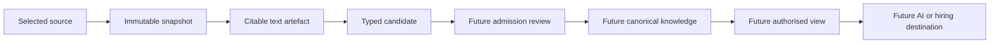

# Why Hire Me

**Why Hire Me builds a private, evidence-backed account of a person's work that AI agents can explore for deeper, fairer, asynchronous hiring.**

People can bring evidence from different sources, turn it into linked knowledge, review what AI
proposes, and later share a controlled view with hiring tools or other AI products. The person owns
the source material and decides what becomes trusted knowledge or leaves their computer.

The project is generic across professions. Source-code inspection is one possible input, not an
assumption about the person or their role.

## What works today

The current command-line workflow can:

1. create a local person profile;
2. capture one explicitly selected file as an immutable SHA-256 snapshot;
3. extract deterministic text from UTF-8 `.txt`, `.md`, and `.markdown` files;
4. cite the extracted text by one-based line range; and
5. stage typed entity proposals for human review.

Supported entity types are `Person`, `Organisation`, `Engagement`, `Role`, `Work`, `Contribution`,
`Artefact`, `Technology`, `TechnologyUse`, and `Credential`.

Staged proposals are not canonical knowledge. They cannot merge identities, run instructions,
influence an evaluation, or publish themselves. PDF, DOCX, OCR, automatic AI extraction,
admission, querying, releases, GitHub delivery, and NotebookLM delivery are not implemented yet.



## Run it locally

You need Node.js 22 or newer and pnpm 10.

```sh
git clone https://github.com/rajanrx/why-hire-me.git
cd why-hire-me
pnpm install
pnpm run check
```

### Install the AI skills

The repository currently ships two portable Agent Skills: `evidence-led-interviewer` and
`daily-work-diary`. Install them into the agent application that runs your chosen model. The skills
guide conversations; continue to run the local data commands from this repository.

| Agent host | Models it can use | Install for local development |
|---|---|---|
| Codex | OpenAI and configured providers | Copy both folders from `skills/` to `~/.codex/skills/`, then start a new Codex session. |
| Claude Code | Claude | Run `claude --plugin-dir .` from this repository. |
| Gemini CLI | Gemini | Run `gemini skills link ./skills/evidence-led-interviewer` and `gemini skills link ./skills/daily-work-diary`. |
| Qwen Code | Qwen and configured providers | Copy both folders from `skills/` to `~/.qwen/skills/`. |
| Deep Code | DeepSeek | Copy both folders from `skills/` to `~/.agents/skills/`. |

For Codex, Qwen Code, or Deep Code on macOS or Linux:

```sh
# Choose one destination for your agent host.
SKILL_HOME="$HOME/.codex/skills"       # Codex
# SKILL_HOME="$HOME/.qwen/skills"     # Qwen Code
# SKILL_HOME="$HOME/.agents/skills"   # Deep Code

mkdir -p "$SKILL_HOME"
cp -R skills/evidence-led-interviewer "$SKILL_HOME/"
cp -R skills/daily-work-diary "$SKILL_HOME/"
```

Restart the agent after copying skills. Gemini CLI can instead reload linked skills with
`/skills reload`. Claude Code validates this repository as a local plugin and loads it for the
session through `--plugin-dir`.

These instructions install the current conversational skills. ChatGPT, the OpenAI API, Claude web,
Gemini web, DeepSeek chat, and other model-only surfaces cannot run the repository's local CLI by
installing a skill. Cross-client tool access will require the planned MCP server and packaged
release. See the official guides for [Claude Code plugins](https://code.claude.com/docs/en/plugins),
[Gemini CLI skills](https://geminicli.com/docs/cli/using-agent-skills/),
[Qwen Code skills](https://qwenlm.github.io/qwen-code-docs/en/users/features/skills/), and
[Deep Code skills](https://api-docs.deepseek.com/quick_start/agent_integrations/deepcode/).

Create a profile. The command returns JSON containing `profile.id`.

```sh
pnpm run cli profile create --name "Your Name"
```

Capture one file. Copy the profile ID from the previous result. This command returns `capture.id`
and the immutable snapshot digest.

```sh
pnpm run cli source ingest \
  --profile "<profile-id>" \
  --file "<resume-or-work-file>"
```

Extract citable text. Copy the capture ID from the capture result. This returns
`extraction.artifact.id` and its line count.

```sh
pnpm run cli evidence extract-text \
  --profile "<profile-id>" \
  --capture "<capture-id>"
```

Stage an entity proposal against an inclusive line range. Copy the text artefact ID from the
extraction result.

```sh
pnpm run cli knowledge stage-entity \
  --profile "<profile-id>" \
  --type Organisation \
  --name "Example organisation" \
  --artifact "<text-artifact-id>" \
  --lines 1:2 \
  --generator-type human \
  --generator local-user \
  --generator-version 1 \
  --uncertainty low \
  --uncertainty-rationale "Named explicitly in the selected evidence" \
  --review person-required \
  --policy private \
  --actor local-user \
  --correlation-id "<your-trace-id>"
```

The CLI stores private data in `~/.why-hire-me` by default. Set `WHY_HIRE_ME_HOME`, or pass
`--database <path>`, to use another location. Commands return structured JSON so scripts and future
AI tools can use the same application boundary.

## Architecture

The core uses hexagonal architecture. Domain and application code own the ports. Filesystems,
SQLite, source readers, model providers, AI hosts, and publication destinations are replaceable
adapters that depend inwards.

TypeScript is the primary runtime. Go is reserved for a measured performance bottleneck behind a
versioned port. SQLite stores local metadata; source snapshots and derived text use private,
content-addressed files. The semantic model is a logical graph of entities and first-class claims,
not a commitment to a graph database.

Read the [product requirements](intent/specs/prd.md), [architecture](intent/specs/architecture.md),
[ontology](intent/specs/_ontology.md), and
[first-release RFC](intent/specs/rfc/RFC-001-first-knowledge-release.md) for the durable design.

## AI plugin

The repository includes a Codex plugin manifest at `.codex-plugin/plugin.json`. Its current skills
are `evidence-led-interviewer` for evidence-led professional discovery and structured evaluation,
and `daily-work-diary` for private work reflection. Skills coordinate conversations and tools; they
do not own or bypass domain data.

The runtime commands are still development interfaces. A packaged end-user installer and hosted
destination connectors are future work.

## Change governance

Durable intent lives under `intent/specs`. Proposed behaviour starts as an intent-linked OpenSpec
change under `openspec/changes`, receives one quick review, and is implemented only after approval.
Completed changes are archived and their capability specifications remain under `openspec/specs`.
The project deliberately uses no review council.

Use these checks before committing:

```sh
pnpm run check
pnpm run spec:validate
```

> [!important] Your next steps
> - [ ] Run the local workflow with a small UTF-8 résumé or work note.
> - [ ] Read the architecture and first-release RFC before proposing a new adapter or domain.
> - [ ] Open an intent-linked OpenSpec change for new behaviour.
