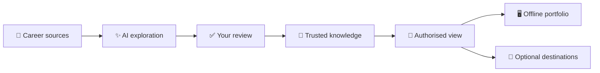

# Why Hire Me

**Turn the real evidence behind your career into private knowledge that AI can explore—and share
only the story you choose.**

A CV cannot hold every decision, contribution, lesson, credential, or piece of work that shows what
you can do. Why Hire Me helps you recover that context, connect it to evidence, and use AI for
thoughtful, asynchronous career conversations.

## 🚀 Start in three steps

| Step | What to do | Status |
|---|---|---|
| 1 · Install | Run `npx skills add rajanrx/why-hire-me --skill '*' -g`, choose your AI app, then restart it | ✅ Available |
| 2 · Explore | Ask: “Use `why-hire-me:evidence-led-interviewer` to explore this project and understand my contribution.” | ✅ Available |
| 3 · Share | Review your knowledge, generate an offline career portfolio, then optionally publish it through the platform of your choice | 🧭 Upcoming |

You stay in control throughout. AI may explore and propose; you decide what becomes trusted
knowledge and what can leave your computer.

## ✨ AI skills

| Skill | Direction | What it helps you do | Status |
|---|---|---|---|
| `why-hire-me:evidence-led-interviewer` | 🧭 Workflow | Explore career evidence and ask focused follow-up questions without unsupported profiling | ✅ Available |
| `why-hire-me:daily-work-diary` | 🧭 Workflow | Privately reconstruct your day, decisions, progress, and learning before useful details disappear | ✅ Available |
| `why-hire-me:input-resume-explorer` | 📥 Input | Explore a résumé and propose typed career knowledge with precise citations | ✅ Available |
| `why-hire-me:input-work-evidence-explorer` | 📥 Input | Inspect authorised code, designs, writing, case work, and other local work for meaningful evidence | ✅ Available |
| `why-hire-me:input-career-reference-explorer` | 📥 Input | Follow approved links, portfolios, publications, and credentials while preserving their origin and verification state | ✅ Available |
| `why-hire-me:knowledge-curator` | 🛡️ Governance | Review semantic proposals, resolve ambiguity, and connect accepted entities and claims without creating a dumping ground | ✅ Available |
| `why-hire-me:output-career-knowledge-guide` | 📤 Output | Answer a person's or authorised visitor's questions with evidence from a bounded knowledge view | 🧭 Upcoming |
| `why-hire-me:async-interview` | ⚖️ Evaluation | Prepare and run structured, role-relevant asynchronous interviews without replacing accountable human decisions | 🧭 Upcoming |
| `why-hire-me:job-application-tailor` | 🧭 Workflow | Match an authorised job description to career evidence, evaluate gaps, and draft a truthful résumé and cover letter | 🧭 Upcoming |
| `why-hire-me:output-career-portfolio` | 📤 Output | Generate an appealing offline HTML portfolio with an overview, evidence graph, and résumé | 🧭 Upcoming |
| `why-hire-me:output-career-publisher` | 📤 Output | Preview a portable release and route it to one or more destination-specific publishing skills | 🧭 Upcoming |
| `↳ why-hire-me:output-github-release` | 📤 Output | Publish an authorised, versioned knowledge release and assets through GitHub | 🧭 Upcoming |
| `↳ why-hire-me:output-notebooklm-sync` | 📤 Output | Synchronise an authorised knowledge projection to NotebookLM without making it public automatically | 🧭 Upcoming |
| `↳ why-hire-me:output-firebase-publisher` | 📤 Output | Publish an authorised static career portfolio through Firebase and return its address | 🧭 Upcoming |

Plugin-aware hosts use the `why-hire-me:<skill>` namespace. Skill-only hosts may show the same
capabilities without the prefix because individual skill names stay portable. The installer
supports Codex, Claude Code, Gemini CLI, Qwen Code, and other compatible agent hosts.

Other useful prompts:

- “Use `why-hire-me:daily-work-diary` to help me remember what I achieved today.”
- “Find the strongest evidence of my contribution and ask about anything important that is
  missing.”
- “Help me prepare career evidence for an asynchronous interview without scoring or profiling me.”

See the [examples guide](docs/examples.md) for copyable prompts, expected skill responses, and a
sample development CLI session. Each available skill has its own focused example page.

### Claude Code plugin marketplace

```sh
claude plugin marketplace add rajanrx/why-hire-me
claude plugin install why-hire-me@why-hire-me
```

## 🧭 From career evidence to something people can explore



The design works across professions. A résumé, portfolio, document, credential, link, work sample,
or selected source-code folder can be an input. Source-code inspection is one adapter, not an
assumption about the person or their role.

The local runtime can already capture a selected text file, preserve an immutable snapshot, create
precise citations, stage typed entities, and record an accept, reject, or defer decision. Only
accepted proposals become canonical knowledge.

## 🌐 Your career portfolio, local first

The upcoming `output-career-portfolio` skill will turn one authorised, versioned knowledge release
into a polished static HTML portfolio containing:

- a clear career overview;
- an explorable graph of roles, organisations, work, contributions, technologies, and credentials;
- an evidence-backed résumé that is easy to read and print; and
- visible sources, limitations, release version, and freshness information.

The report will work locally without an account, analytics, remote fonts, or a network connection.
It will remain an output projection—not a second source of truth—and will never add unreviewed
claims.

Hosted sharing will use replaceable destination adapters, so people can choose the platform that
suits them. Firebase Hosting is one possible adapter, not an architectural dependency. After
explicit sign-in and a final preview, a connector can publish the same static portfolio and return
its shareable address. Credentials stay outside the release, and “uploaded” remains distinct from
“public”. The offline report keeps working without any hosted platform. Pricing and quotas belong
to the selected destination rather than the core product.

## 🛡️ Trust is part of the product

| Principle | What it means |
|---|---|
| 🔐 Private by default | Sources and knowledge stay local unless you approve a bounded output |
| 🔎 Evidence first | Factual knowledge keeps its source and derivation instead of becoming generated prose |
| ✅ Human reviewed | AI cannot promote its own proposals into trusted knowledge |
| 🔌 Vendor independent | GPT, Gemini, NotebookLM, GitHub, Firebase, and future systems remain replaceable adapters |
| 📦 Portable | Versioned releases can be validated and used without the original application |
| ⚖️ Hiring aware | Discovery stays separate from formal evaluation, scoring, or hiring decisions |

## 🏗️ Built to grow without losing its centre

Why Hire Me uses hexagonal architecture. Domain and application code own the ports; filesystems,
SQLite, AI providers, interfaces, and publication destinations plug in as replaceable adapters.
TypeScript is the primary runtime. Go is reserved for a measured performance bottleneck behind a
versioned port.

Developers can follow the complete [local CLI guide](https://github.com/rajanrx/why-hire-me/blob/main/docs/development-cli.md).
The durable design lives in the [product requirements](https://github.com/rajanrx/why-hire-me/blob/main/intent/specs/prd.md),
[architecture](https://github.com/rajanrx/why-hire-me/blob/main/intent/specs/architecture.md),
[ontology](https://github.com/rajanrx/why-hire-me/blob/main/intent/specs/_ontology.md), and
[first-release RFC](https://github.com/rajanrx/why-hire-me/blob/main/intent/specs/rfc/RFC-001-first-knowledge-release.md).
Development intent, OpenSpec changes, source files, and tests stay in the repository rather than the
end-user release archive.

## 📜 Licence and project identity

Why Hire Me is open-source software licensed under [GNU AGPL-3.0-or-later](LICENSE). You may use,
study, modify, and redistribute it under that licence. Modified versions operated over a network
must offer their corresponding source as required by the AGPL.

The [trademark policy](TRADEMARKS.md) protects the Why Hire Me name and branding. Forks may describe
their origin or compatibility, but they must use a distinct product identity and must not imply
official approval.

> [!important] Your next steps
> - [ ] Install the available AI skills.
> - [ ] Start one evidence-led career conversation.
> - [ ] Follow the project to help shape the offline portfolio and optional hosted sharing.
