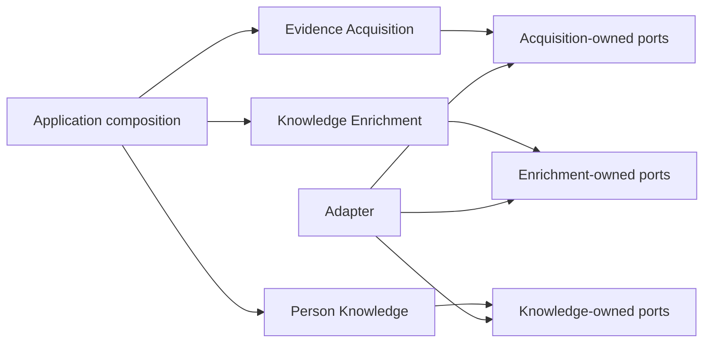

# ADR-0012: Govern bounded-context dependencies through owned contracts

## Context

Hexagonal layers prevent frameworks from entering the core, but they do not by themselves prevent
one domain from importing another domain's types or repository ports. Those imports make ownership
unclear and allow a change in one bounded context to spread through unrelated business rules.

## Decision

Production code inside `src/domains/<domain>` may import only modules inside the same domain. A
domain expresses every external need through a port it owns, using its own contract types.

Driving applications and adapters compose domains. They translate one domain's published result
into another domain's input without giving either domain access to the other's repository. A shared
kernel may be introduced only by a later ADR naming its owner, compatibility rules, and consumers.

Architecture tests scan every production domain module and fail on cross-domain, adapter, or app
imports. Tests may compose real adapters, but production boundaries remain isolated.

## Consequences

- Domain ownership is visible from imports and can be enforced without runtime infrastructure.
- Similar concepts may need explicit translation types at boundaries.
- Composition code carries more mapping, but domain changes stop propagating accidentally.
- Direct reuse of another domain's repository or branded ID type is not permitted.

## Rejected directions

- A layered-only rule was rejected because it still permits hidden domain coupling.
- A broad shared-model package was rejected because it would become an ownerless integration model.
