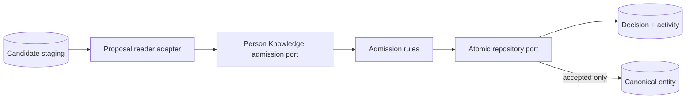

# ADR-0016: Own admission in Person Knowledge

## Context

Knowledge Enrichment proposes meaning, but it must not gain authority to create canonical records.
Person Knowledge needs to consume proposals without importing another bounded context's domain model
or coupling admission rules to SQLite.

## Decision

Person Knowledge owns the admission use case, its input proposal contract, decisions, canonical
entity and activity records, and persistence ports. An adapter translates a staged enrichment
candidate into that contract and commits a decision, activity, and optional entity atomically.

Acceptance is human-led in the first release. A person or authorised policy reviewer must satisfy
the candidate's declared review requirement. Possible duplicates and conflicts must be explicitly
resolved before acceptance. Accepted and rejected decisions are terminal; deferred decisions are
recorded but may be followed by a later decision. Retrying the same request with the same
idempotency key returns the original result, while reusing that key for different input fails.

## Consequences

- Enrichment remains advisory and cannot write canonical knowledge.
- Storage and future API adapters can change without moving governance out of the core.
- Deferred review and safe retries are auditable.
- Claims, identity merging, automated policy approval, and canonical aliases remain later changes.
