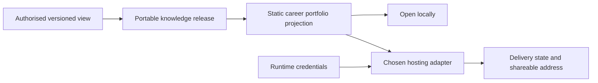

# ADR-0017: Render an offline portfolio before hosted delivery

## Context

A person needs a useful, attractive way to review and share their career knowledge without first
joining a hosting platform. The same portfolio may later be published through a platform chosen by
the person, but no destination may become the source of truth or gain direct access to canonical
storage.

## Decision

Add an offline career portfolio as a Publication projection. It consumes one immutable,
authorised, versioned knowledge release and produces static HTML with a career overview, an
explorable knowledge graph, a readable and printable résumé, evidence references, limitations,
freshness, and release identity.

The local projection is useful on its own. It uses no remote fonts, analytics, advertisements, or
required network resources. Rendering is deterministic for the same release and renderer version,
and generated narrative remains visibly derived rather than becoming canonical knowledge.

Add hosted platforms only through `DestinationPublisher` adapters. An adapter receives the
already-built portfolio projection, obtains credentials at runtime through `CredentialProvider`,
requires a final preview and explicit delivery request, and records the returned destination and
observed visibility. It never queries Person Knowledge directly. Firebase Hosting is one possible
reference adapter, not a privileged destination.

No-cost hosting allowances are a destination concern, not a domain guarantee. The adapter must
report plan or quota failures without affecting the offline portfolio.

## Consequences

- A person receives value before connecting any hosted service.
- Offline and hosted portfolios represent the same approved release.
- Destination authentication, quotas, deployment, and visibility remain outside the core.
- HTML escaping, content security, accessibility, responsive layout, printing, and graph usability
  become projection acceptance requirements.
- Updating career knowledge creates a new release and projection; it does not silently mutate an
  already-shared version.

## References

- [Firebase Hosting quickstart](https://firebase.google.com/docs/hosting/quickstart)
- [Firebase pricing](https://firebase.google.com/pricing)
