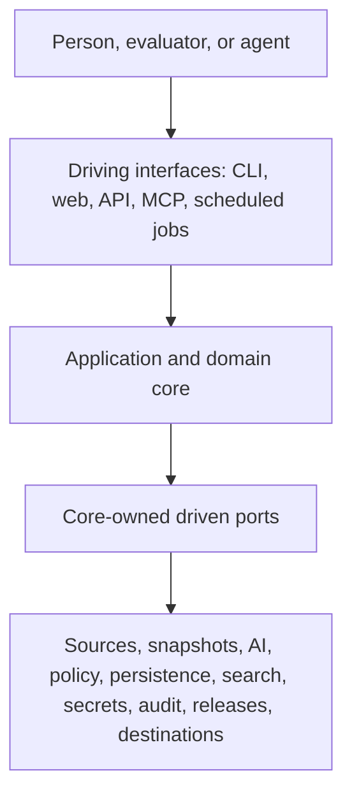
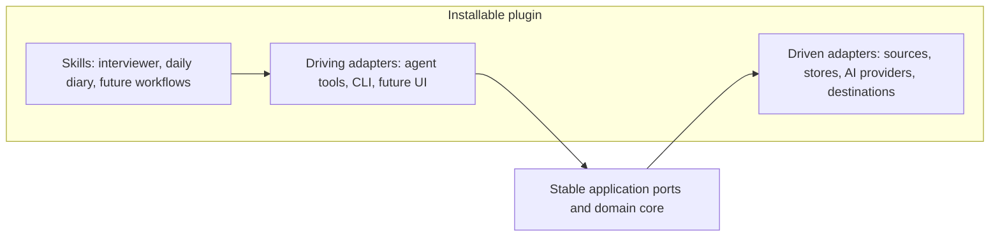
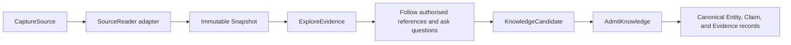
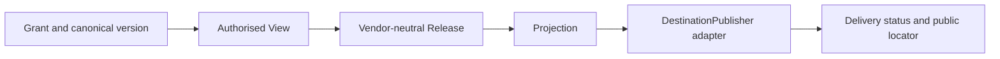
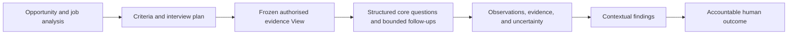

# Architecture

This is the current target shape. It records system boundaries and flows without choosing a
language, framework, database, model provider, or deployment topology prematurely.

## Diagram convention

Architecture diagrams use Mermaid in Markdown by default so their source is reviewable, diffable,
and rendered by GitHub. Use draw.io when Mermaid cannot express the required layout; commit the
editable `.drawio` source alongside any exported image.

## System context

NotebookLM, GPT, Gemini, GitHub, local files, model providers, databases, and protocols are edge
adapters. None is part of the canonical domain model.

## Distribution boundary

The repository is packaged as an installable AI plugin. The plugin composes skills and, as they are
implemented, local tools and MCP servers. It is a delivery boundary around the application, not a
sixth domain and not the canonical owner of knowledge.

Installation grants no implicit authority. Each connector is optional, declares its required
permissions, and receives credentials at runtime. Host-specific packaging may change while domain
and release contracts remain portable.

## Domain responsibilities

| Domain | Owns | Does not own |
|---|---|---|
| **Evidence Acquisition** | Source authority, capture runs, immutable snapshots | Semantic interpretation |
| **Knowledge Enrichment** | Exploration, questions, responses, candidate knowledge | Canonical truth or hiring outcomes |
| **Person Knowledge** | Admitted entities, claims, evidence links, identity, grants, views | Source access or destination delivery |
| **Publication** | Releases, projections, deliveries, destination state | Canonical knowledge or credentials |
| **Evaluation** | Opportunity, criteria, interview, findings, contextual outcome | The person's canonical profile |

Communication crosses domain-owned application ports. A domain never reaches into another
domain's storage.

Production domain modules also never import another bounded context directly. App composition and
adapters translate between domain-owned contracts. Person Knowledge owns the controlled predicate
registry used to validate claim meaning and entity-type pairs.

## Primary flow: build knowledge

Raw sources, transcripts, and AI output do not bypass admission.

## Primary flow: publish knowledge

A GitHub release asset and a NotebookLM notebook are deliveries of the same logical release, not
independent sources of truth.

## Primary flow: evaluate a person

Evaluation findings never become canonical person knowledge automatically.

## Hexagonal boundaries

- Driving ports describe user-visible use cases, not generic CRUD.
- Driven ports describe capabilities required by the core.
- Ports use domain types and stable contract versions, never vendor payloads.
- Adapters translate authentication, pagination, rate limits, formats, and failures.
- Tools expose operations; skills coordinate tools; neither weakens domain policy.
- Contract tests prove adapter substitutability.

## Knowledge state

Three state classes remain separate:

1. source snapshots: immutable or tamper-evident evidence;
2. canonical semantic records: entities, claims, provenance, lifecycle, and access metadata; and
3. derived state: search indexes, embeddings, graph projections, caches, releases, and vendor copies.

The logical graph is implemented through first-class entities and claims with stable IDs. Physical
storage remains behind repository ports.

## Runtime and scaling

Start as a modular application with in-process domain boundaries. Distribution is earned by
measured load, isolation, or operational needs.

TypeScript is the primary product runtime. Go may implement a measured hot path as an
out-of-process adapter or worker behind a versioned port; it never owns domain policy or reaches
across a domain's persistence boundary.

- Capture, enrichment, projection, and delivery are idempotent jobs.
- Long-running and retryable work can move to workers without moving domain rules.
- Canonical writes remain strongly governed; read projections may be eventually consistent.
- Every projection records the canonical version or event position it represents.
- Source snapshots and release assets can scale separately from metadata.
- Full-text, vector, and graph query engines are replaceable read adapters.
- Domain events cross modules through an application-owned mechanism; a broker is not required initially.

## Trust boundaries

- Local paths, remote content, résumés, repositories, model output, and connector responses are untrusted.
- Permission is checked before acquisition and again before retrieval or publication.
- Secrets are resolved at runtime through a credential port and never enter knowledge or releases.
- Source content cannot grant tool authority or modify agent/system instructions.
- Public delivery is irreversible in practice once third parties download it; disclosure precedes publication.
- All AI-derived claims and evaluation findings retain model/process provenance and human disposition.

## Reference implementation profile

The first vertical slice may use:

- an installable AI plugin and a CLI as driving adapters;
- résumé-file and explicitly scoped local-workspace input adapters;
- the `evidence-led-interviewer` and `daily-work-diary` enrichment skills;
- a SQLite semantic repository with content-addressed snapshot files;
- a local directory/ archive as the first release adapter.

These are reference adapters, not architecture commitments. GitHub and NotebookLM follow only
after the portable release contract works locally.

## Decisions still open

- local-first, hosted, or hybrid deployment;
- the first physical repository adapter;
- event and consistency semantics across processes;
- encryption and key ownership;
- identity resolution and organisation registries;
- public-query protocol and abuse controls;
- deletion guarantees after external publication.
