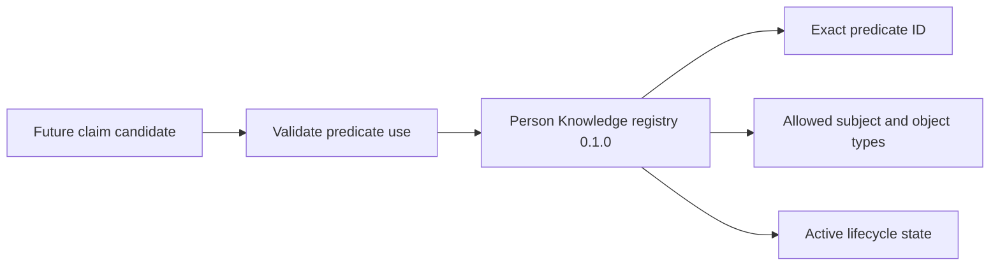

## Context

The current layer check blocks adapter and app imports but permits domain-to-domain imports.
Evidence Acquisition currently imports Person Knowledge profile types and its repository port. The
semantic contract requires controlled predicates, but no executable registry exists.

## Goals / Non-Goals

**Goals:** remove existing cross-domain production imports, enforce domain isolation, and provide a
dependency-free, immutable predicate registry matching the governed standard.

**Non-Goals:** shared-kernel extraction, distributed services, claim persistence, runtime registry
mutation, or external vocabulary mapping.

## Decisions

### Acquisition owns its profile-existence need

Add an acquisition `KnowledgeSpaceResolver` port using acquisition-owned string identifiers.
`CaptureSource` asks it whether the requested profile-backed knowledge space exists. CLI composition
adapts the Person Knowledge repository without exposing that repository to acquisition.

Alternative: declare Person Knowledge a compile-time dependency. Rejected because a branded ID and
repository would leak ownership across the boundary.

### Resolve imports relative to each bounded context

The architecture test derives the containing domain from each production path and resolves relative
imports. Any resolved production path outside that domain fails. Bare package imports are separately
checked against the existing framework/vendor rule.

### Keep the registry as immutable domain data

Person Knowledge exports registry version `0.1.0`, frozen definitions, exact lookup, and
subject/object validation. Definitions contain IDs, human labels, meanings, lifecycle, version, and
entity-type sets. There is no registration method.

Alternative: load editable rows from SQLite. Rejected because adapters could alter canonical
meaning without a reviewed code and intent change.

## Risks / Trade-offs

- **Domain adapters require explicit mapping** → Keep mappings at composition edges and test them.
- **The initial predicate set will grow** → Add entries compatibly; never change an ID's meaning.
- **Static data requires a release to change** → This is intentional governance for semantic meaning.

## Migration Plan

Replace acquisition's cross-domain type imports without changing stored IDs or CLI output. Add the
registry as a new read-only API. Rollback restores the old imports and removes registry consumers;
no data migration is required.
