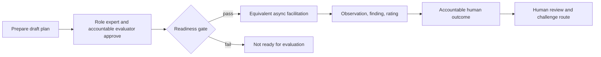

## Context

The evidence-led interviewer defines formal-evaluation safeguards. This skill specialises those rules
for time-separated delivery, where deadlines, pause and resume, response formats, technical failures,
and delayed human review create additional comparability and accessibility concerns.

## Goals / Non-Goals

**Goals:** explicit modes; readiness gate; equivalent core content; controlled probes; accessible
asynchronous delivery; separated records; accountable and contestable human outcome.

**Non-goals:** automated selection, hidden profiling, casual discovery, or productivity monitoring.

## Decisions

### Decision: asynchronous is a delivery envelope

The skill reuses formal evaluation records and adds timing, format, notice, accommodation, and
delivery events. It does not define a weaker evaluation standard.

### Decision: readiness fails closed

Facilitation and review require approved opportunity analysis, criteria, questions, anchors, evidence
view, policy, notice, rights, and accountable evaluator. Preparation remains explicitly draft.

### Decision: operational events are not performance evidence

Pauses, time zones, accommodations, and technical failures are retained for process audit but cannot
be scored unless an independently justified approved criterion says otherwise.

## Risks / Trade-offs

- **Convenience weakens structure** → reuse the full formal-evaluation standard.
- **Timing becomes an accidental criterion** → separate operational delivery events from evidence.
- **Adaptive probes reduce comparability** → allow only declared probe families and equivalent opportunities.
- **AI drafts become decisions** → require explicit authorised evaluator disposition and human outcome.

## Validation

Validate skill and plugin structure, cross-skill references, installer discovery, bundle contents,
strict OpenSpec, and the complete repository. Complete one quick review before archive.
