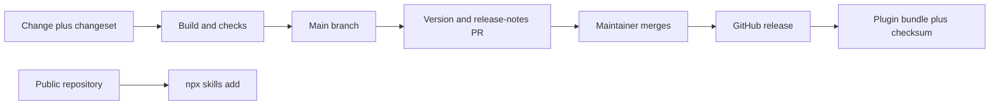

## Context

The repository contains valid Agent Skills and a plugin manifest, but distribution depends on a
manual checkout. The package is private, so the release flow must not require npm publication.

## Decisions

### Install skills directly from the public repository

Use `npx skills add rajanrx/why-hire-me -g` as the primary command. The Skills CLI discovers both
skill folders and offers compatible installed agents. Host-specific plugin marketplaces remain
optional because they require different commands and catalogue formats.

### Separate validation from release orchestration

CI runs on pull requests and pushes. The release workflow runs only on `main`, first runs the full
check, then lets Changesets create a version pull request or publish a tagged private-package
release.

### Package only distributable content

The release bundle contains manifests, skills, compiled CLI files, package metadata, the README,
changelog, and licence. It excludes source control, local data, dependencies, and development
state. A SHA-256 checksum accompanies the archive.

## Risks and limits

- The release action needs repository permission to create pull requests and releases.
- `npx` is much easier than cloning, but it is not yet a graphical recruiter experience.
- GitHub-hosted installation requires network access and trust in the public repository.
