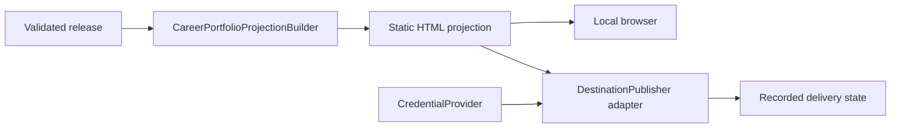

## Context

Person Knowledge can admit entities. Authorised views and vendor-neutral releases were originally
prerequisites; they now ship through the separately reviewed `stable-local-publication-runtime`
change, so this change can implement the projection and reference delivery adapter without crossing
the canonical boundary.

## Goals / Non-Goals

**Goals:** make the first human-facing output useful offline; keep rendered narrative derived and
traceable; keep every hosting platform optional; protect the Person Knowledge and Publication
boundaries.

**Non-Goals:** bypass the release pipeline, host canonical data, add analytics, or promise a
destination's pricing and availability.

## Decisions

### One projection, two delivery choices

`ProjectionBuilder` consumes a validated release and produces a static portfolio. Opening it from
disk is the first delivery. A chosen hosting platform receives the same bytes through
`DestinationPublisher`.

### Useful, appealing, and inspectable

The information hierarchy is overview first, then connected career graph, résumé, selected evidence,
and release details. The graph enhances navigation but never becomes the only way to read the
information. The résumé is a labelled projection of accepted knowledge, not imported truth.

### Offline means no hidden network dependency

Required scripts, styles, icons, and fonts are local. The renderer escapes untrusted content,
produces a restrictive content-security policy, supports keyboard navigation and reduced motion,
and provides a readable print layout. The same release and renderer version produce the same files.

### Every hosting platform remains an adapter

Interactive sign-in or another credential source is an adapter choice. Credentials never enter the
projection or release. A delivery request shows the destination and intended visibility, requires
explicit confirmation, then records upload and observed public state separately. Firebase Hosting
may be a reference implementation, but its concepts do not enter the core contract.

## Risks / Trade-offs

- **A rich graph can become visual clutter** → provide filters, progressive disclosure, and an
  equivalent structured list.
- **Generated résumé language may overstate evidence** → render only accepted knowledge, retain
  citations, and label derived text.
- **Static output can be copied after sharing** → disclose irreversibility before hosted delivery.
- **Platform pricing or quotas can change** → report destination failures and preserve the offline
  output without promising a free tier.

## Migration Plan

Existing databases add disclosure-view tables on first use. Authorised views and local releases land
through their own reviewed change; this change then adds the renderer, skill, and reference Firebase
Hosting adapter behind Publication ports.
