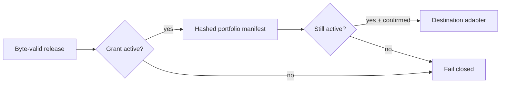

## Context

An immutable release can remain structurally valid after the grant used to create it expires. That is
useful for audit, but it must not silently become continuing authority to create or publish new output.

## Decision

Release integrity validation remains time-independent. The portfolio application checks the release
view expiry before rendering. The renderer copies that expiry into the portfolio manifest and covers
it with the projection digest. Destination validation checks it again immediately before credentials
are resolved or a publisher is invoked.

Existing local portfolio files are not deleted at expiry. The boundary prevents a new render or
publication; it does not promise recall of copies already created or shared.
