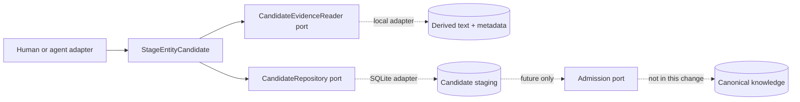

## Context

Text artefacts now provide deterministic line-addressable evidence. No staging store or executable
candidate schema exists. See `proposal.md` and the capability spec for scope.

## Goals / Non-Goals

**Goals:** establish a stable application contract usable by human, skill, or model adapters; reject
invalid evidence atomically; keep proposal identity deterministic and storage-neutral.

**Non-Goals:** infer entities, define relationship predicates, merge identities, or implement
admission and canonical repositories.

## Decisions

### Core-owned staging orchestration

`StageEntityCandidate` validates the candidate shape, resolves every citation through a
`CandidateEvidenceReader`, then writes through `CandidateRepository` and `ActivitySink` semantics
combined in one staging port. The SQLite adapter implements the port; CLI JSON/options are a driving
adapter.

Alternative: allow each model adapter to persist its own JSON. Rejected because evidence scope,
identity, lifecycle, and provenance would diverge by provider.

### Restrict the first schema to entity identity proposals

The type registry is the ten entity families already named by the conceptual model. A proposal has
a display name but no unrestricted attribute bag. Attributes and claims arrive only with governed
type schemas and predicates.

Alternative: accept arbitrary JSON-LD. Rejected because syntactic flexibility would undermine the
anti-dumping-ground boundary.

### Deterministic identity plus append-only submissions

The repository hashes canonical JSON for knowledge space, type, normalised name, sorted evidence,
generator identity/version, uncertainty, review requirement, identity hints, and policy labels.
The candidate row is idempotent; each attempt creates a separate submission activity with actor,
time, and correlation ID.

### Evidence resolution does not expose other profiles

The reader returns only a same-profile artefact's line count and snapshot lineage. Missing and
foreign artefacts produce the same unavailable error. All references validate before a transaction
writes the candidate or activity.

## Risks / Trade-offs

- **Display-name-only candidates are intentionally sparse** → Add type-specific attributes through
  reviewed schema changes rather than an ungoverned map.
- **Equivalent names do not prove identity** → Store identity hints only; never merge automatically.
- **SQLite is the first adapter** → Domain contracts and deterministic canonical JSON remain
  independent of persistence.

## Migration Plan

Add idempotent staging tables. Existing profile, capture, extraction, and snapshot data are
unchanged. Rollback removes the command and code without promoting or deleting staged data.
