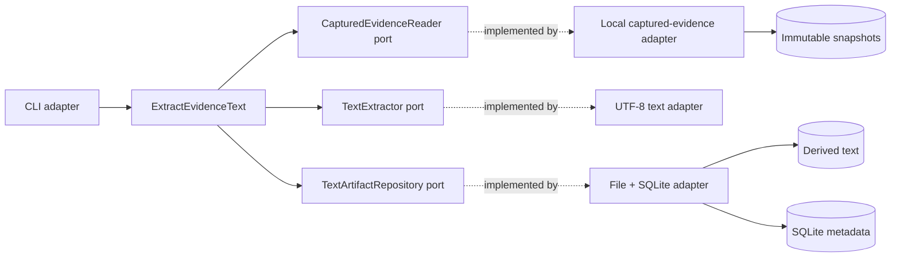

## Context

The acquisition slice stores immutable snapshot bytes and capture metadata. Knowledge Enrichment
has durable port definitions but no runtime module. See `proposal.md` and the capability spec for
the new behaviour.

## Goals / Non-Goals

**Goals:**

- Establish the first Knowledge Enrichment application boundary.
- Make derived text reproducible, private, addressable, and queryable.
- Allow future PDF, DOCX, OCR, and model adapters without changing orchestration.

**Non-Goals:**

- Treat file extensions as verified media types beyond selecting this first extractor.
- Produce semantic candidates or expose extracted text outside local storage.
- Introduce Go without a measured bottleneck.

## Decisions

### Keep extraction behind Knowledge Enrichment ports

`ExtractEvidenceText` depends on `CapturedEvidenceReader`, a registry of `TextExtractor` ports, and
`TextArtifactRepository`. Adapters resolve captured evidence, decode a supported format, and store
derived artefacts. The application service owns scope validation, outcome recording, and selection.

Alternative: place extraction in Evidence Acquisition. Rejected because acquisition owns faithful
capture while interpretation and derived evidence belong to enrichment.

### Store a derived artefact, not candidate knowledge

A completed artefact records snapshot lineage, extractor identity/configuration, output SHA-256,
line count, and a content-addressed storage key. Each command records a completed or failed attempt.
Nothing calls the candidate-admission port in this change.

Alternative: immediately ask an AI model for résumé claims. Rejected because it couples deterministic
format handling to probabilistic inference and skips the reviewable evidence representation.

### Begin with strict UTF-8 text formats

The first extractor accepts `.txt`, `.md`, and `.markdown`, uses fatal UTF-8 decoding, strips one
leading BOM, and normalises CRLF/CR to LF. It does not execute, render, or interpolate content.
Extractor identity, version, and configuration participate in artefact identity.

Alternative: add PDF and DOCX libraries now. Rejected until the core lifecycle and citation contract
are proven; those formats become independent adapters.

### Publish bytes before metadata

The local repository writes derived text through a private temporary file and atomically publishes
it by content address before committing SQLite metadata. Repeated equivalent results reuse the
same artefact and bytes. A crash can leave an unreferenced derived file but never a completed row
pointing to absent bytes.

## Risks / Trade-offs

- **Filename extension can be misleading** → Strict decoding detects invalid UTF-8; richer media
  detection belongs in later extractor adapters.
- **Line normalisation loses original byte offsets** → Citations retain snapshot lineage and refer
  to the deterministic derived artefact; raw bytes remain available for audit.
- **Very large text remains expensive to inspect** → Decode incrementally at the adapter boundary;
  add measured size or streaming-index policy in a later change rather than an arbitrary limit.
- **Filesystem and SQLite lack a shared transaction** → Persist bytes first and verify their
  presence before recording a completed attempt.

## Migration Plan

Add idempotent derived-text tables and a private `derived/text` directory. Existing captures and
profiles remain unchanged. Rollback removes the command and code without deleting recoverable data.
