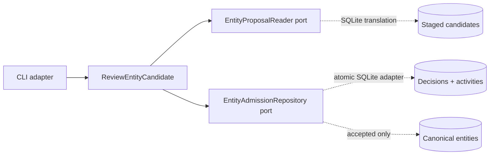

## Context

Knowledge Enrichment can stage evidence-linked entity candidates. Person Knowledge has no input
port for reviewing them and no canonical entity or activity repository. The domain boundary test
also forbids importing the enrichment model directly.

## Goals / Non-Goals

**Goals:** keep canonical authority in Person Knowledge; make human review and ambiguity resolution
explicit; commit audit and entity records atomically; support safe retries.

**Non-Goals:** infer candidates, merge identities, admit claims, automate review, or publish data.

## Decisions

### Translate at the adapter boundary

Person Knowledge defines a small `EntityProposal` input contract. The SQLite adapter reads the
staged JSON and translates it into that contract. Neither bounded context imports the other.

### Record all outcomes; give only acceptance canonical authority

Every request produces `accepted`, `rejected`, or `deferred` with reviewer, reason, time, and
correlation data. Accepted decisions create one entity and one admission activity in the same
transaction. Other decisions create the activity and decision only.

### Require explicit ambiguity resolution

An accepted proposal with possible duplicates requires a `distinct` resolution. A proposal with
conflicts requires a `resolved` resolution. Either case requires a resolution reason. This change
does not merge identities; a future identity-resolution capability will add that path.

### Terminal decisions and idempotent requests

Acceptance and rejection are terminal for a candidate. Deferral is auditable and revisitable. The
repository scopes idempotency keys to one knowledge space and returns the original result only when
the material request is identical.

## Risks / Trade-offs

- **Human-only review limits automation** → add policy reviewers only after grants and policy
  evaluation are executable.
- **No merge path can defer genuine duplicates** → preserve ambiguity instead of silently creating
  the wrong identity.
- **SQLite spans staging and canonical tables** → the adapter translates between core-owned
  contracts; the domains remain independent and can use separate stores later.

## Migration Plan

Create additive strict tables and indexes. Existing candidates remain proposed and reviewable.
Rollback removes the command and code without changing previously staged records.
