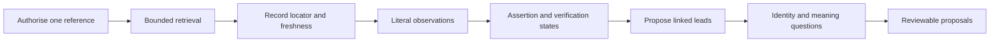

## Context

External references vary in authority, stability, access, and identity assurance. A portfolio is
normally person-controlled; a credential record may be issuer-controlled; a publication index may be
independent. None of those categories alone proves the whole claim.

## Goals / Non-Goals

**Goals:** bound retrieval; preserve source identity and freshness; distinguish assertion, identity,
and verification; remain provider-neutral; reuse candidate admission.

**Non-goals:** a crawler, background-check service, universal trust score, automatic verification,
formal evaluation, or publication.

## Decisions

### Decision: default traversal depth is zero

The authorised reference is read first. Links and identifiers are leads. Each approved lead becomes
a distinct source with independent provenance rather than silently extending the first source.

### Decision: verification is a set of states, not a confidence score

Observation, publisher assertion, identity linkage, independent verification, and unresolved status
describe different evidence operations. They cannot be inferred from appearance, matching names, or
publisher category alone.

### Decision: live reading and governed capture remain distinct

Only provenance-preserving capture plus candidate staging enables `governed-import`. Temporary host
reading produces a `session-only`, `not-persisted` preview.

## Risks / Trade-offs

- **Pages change or disappear** → retain retrieval time, digest where available, and explicit freshness.
- **Official appearance overstates authority** → record publisher relationship without converting it to truth.
- **Names collide** → require identity evidence and preserve ambiguity.
- **Links expand scope invisibly** → require separate authorisation and provenance for every followed lead.

## Validation

Validate skill structure, references, installer discovery, bundle contents, strict OpenSpec
conformance, and the complete repository. Complete one quick review before archive.
