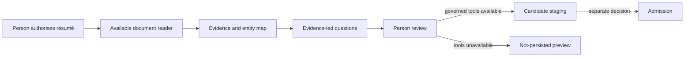

## Context

The plugin has a reusable evidence-led interviewer and a local runtime that captures UTF-8 text and
Markdown. AI hosts may also supply PDF or DOCX readers, but skill installation does not guarantee a
capture or persistence tool.

## Goals / Non-Goals

**Goals:** make résumé exploration useful now; preserve evidence and uncertainty; remain generic
across roles and document readers; report persistence honestly.

**Non-Goals:** implement PDF or DOCX parsing in the core, crawl references, rewrite prose, verify
credentials, or evaluate a candidate.

## Decisions

### One workflow with two explicit modes

The skill declares `governed-import` only when capture, stable locators, and candidate tools are
available. Otherwise it declares `session-only` and returns a `not-persisted` review preview. The
semantic workflow stays useful without fabricating storage guarantees.

### Compose the existing interviewer

The skill uses `evidence-led-interviewer` in knowledge-discovery mode for question selection. It
does not duplicate formal-evaluation rules or claim scientific validity for résumé interpretation.

### Preserve the conceptual model

Employment is modelled through Organisation, Engagement, and Role. Work, Contribution, Artefact,
TechnologyUse, and Credential remain separate proposals. Exact source observations stay separate
from normalised labels and inferred claims.

## Risks / Trade-offs

- **Host readers expose different locators** → record the locator scheme and limitations rather than
  pretending all formats have line numbers.
- **Session-only results are less durable** → label them clearly and offer later governed import.
- **Résumés are polished and selective** → ask focused questions and never equate wording quality
  with capability.

## Migration Plan

Add the skill and reference contract without changing stored data. Future capture adapters can
upgrade a session from preview to governed import through the same workflow.
