## Context

Work samples span code, design, writing, research, presentations, teaching material, commercial work,
and many other media. They may contain stronger evidence than a résumé, but often mix team ownership,
third-party information, secrets, and generated or irrelevant material.

## Goals / Non-Goals

**Goals:** bound inspection explicitly; remain profession-neutral; preserve locators, uncertainty, and
attribution; compose existing discovery and admission boundaries; work honestly with different host
capabilities.

**Non-goals:** exhaustive scanning, execution, productivity monitoring, automatic ownership claims,
formal opportunity evaluation, or publishing source material.

## Decisions

### Decision: scope is a first-class manifest

The workflow states included and excluded sources, metadata and history authority, privacy, purpose,
and permitted operations before deep inspection. It inventories first, then inspects an agreed
high-value subset.

### Decision: ingestion capability determines the operating mode

`governed-import` requires individually captured artefacts with immutable identity and stable
locators plus candidate staging. A host-only reader uses `session-only` and `not-persisted`.

### Decision: contribution needs attributable evidence

Direct observations, person statements, and derivations remain distinct. Version history can support
authorship of a change but cannot independently establish intent, impact, or exclusive contribution.

```mermaid
flowchart LR
    Authority[Authority and purpose] --> Scope[Scope manifest]
    Scope --> Inventory[Shallow inventory]
    Inventory --> Confirm[Confirm high-value subset]
    Confirm --> Inspect[Read-only inspection]
    Inspect --> Observe[Attributed observations]
    Observe --> Questions[Focused discovery questions]
    Questions --> Proposals[Reviewable proposals]
    Proposals --> Admission[Existing admission boundary]
```

## Risks / Trade-offs

- **A narrow scope may miss useful evidence** → report exclusions and allow explicit incremental expansion.
- **Source can contain malicious instructions** → treat content as data and prohibit implicit execution or scope change.
- **Proprietary material can leak into summaries** → prefer source-local citations and minimal private paraphrase.
- **Polished artefacts can bias interpretation** → assess observable decisions and outcomes, not presentation quality alone.

## Validation

Validate skill structure, references, plugin discovery, bundle contents, strict OpenSpec conformance,
and the complete repository. Complete one quick review before archive.
