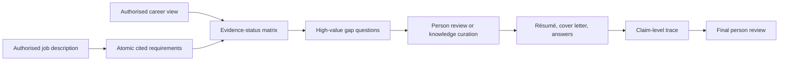

## Context

The supplied Head of IT example contains essential responsibilities, preferred qualifications,
operating context, and administrative questions. A useful workflow must preserve those distinctions,
match them to reviewed evidence, and generate documents without converting ambiguity into experience.

## Goals / Non-Goals

**Goals:** multi-format opportunity input; atomic requirements; evidence-status matrix; honest gap
questions; traceable résumé, cover letter, and answers; local review before any external action.

**Non-goals:** automated submission, employer outreach, comparison with applicants, fit percentage,
or new canonical facts.

## Decisions

### Decision: one workflow coordinates three domain boundaries

Opportunity capture is input, requirement matching is contextual evaluation, and application documents
are projections. `job-application-tailor` remains an unprefixed coordinating workflow because it
crosses both input and output directions deliberately.

### Decision: requirements and generated claims have a many-to-many trace

Each requirement keeps its job-source locator. Each match keeps career record IDs. Every material
generated statement links to both sets so a reviewer can see why it appears and remove it safely.

### Decision: gaps are not repaired by generation

Questions may find overlooked evidence, but person statements remain labelled and durable facts route
through ingestion and curation. No prose transformation can upgrade insufficient evidence.

## Risks / Trade-offs

- **Tailoring becomes fabrication** → generated claims require reviewed evidence and trace links.
- **Keyword matching overstates fit** → classify atomic meaning and prohibit universal fit scores.
- **New answers bypass governance** → label person statements and route durable facts through curation.
- **Sensitive facts enter an application** → separate administrative answers and require explicit review.

## Validation

Validate skill and plugin structure, example, installer discovery, bundle contents, strict OpenSpec,
and the complete repository. Complete one quick review before archive.
