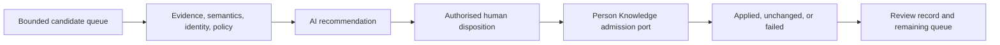

## Context

Evidence ingestion deliberately produces candidates rather than canonical writes. As sources grow,
review must handle dependency order, duplicate identities, conflicts, policy, stale proposals, and
controlled semantics without turning AI into the deciding authority.

## Goals / Non-Goals

**Goals:** bounded review queues; explainable recommendations; human dispositions; safe public-port
application; coherent graph structure; auditable outcomes.

**Non-goals:** autonomous approval, direct database cleanup, deletion, publication, or evaluation.

## Decisions

### Decision: recommendation, disposition, and result are separate records

AI recommends. An authorised human supplies the disposition. The admission port returns whether that
decision was applied, unchanged, or failed. Conversation does not collapse these states.

### Decision: review follows dependency and safety order

Prohibited content and broken provenance come first, followed by identity, conflicts, prerequisite
entities, claims, and low-impact naming. This avoids admitting dependent graph edges prematurely.

### Decision: preview mode is useful but inert

Without complete candidate and admission tools, the skill can explain a bounded queue but labels all
recommendations `not-applied` and makes no canonical claim.

## Risks / Trade-offs

- **Review becomes approval theatre** → require explicit per-candidate human disposition.
- **Graph cleanliness erases history** → preserve conflicts, corrections, supersession, and activities.
- **Large queues overwhelm review** → require bounded filters and dependency ordering.
- **Stale retries change decisions** → use candidate state checks and stable idempotency keys.

## Validation

Validate skill and plugin structure, installer discovery, bundle contents, strict OpenSpec, and the
complete repository. Complete one quick review before archive.
