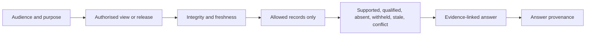

## Context

Q&A is the primary interface through which people and authorised visitors can understand a career
knowledge release. The interface must be useful even when evidence is incomplete while strictly
respecting the view boundary.

## Goals / Non-Goals

**Goals:** bounded read access; explicit audience and purpose; integrity and freshness checks;
evidence-linked answers; safe absence and withholding semantics; portable release support.

**Non-goals:** source access, canonical mutation, view construction, publication, or evaluation.

## Decisions

### Decision: the view is the complete authority boundary

The guide cannot use private source stores, broad conversational memory, or external research to
complete an answer. Corrections route to curation and remain outside the current answer version.

### Decision: absence and withholding are first-class results

`not-in-view`, `withheld`, and `stale` do not imply lack of experience. Withholding does not expose
hidden record existence or metadata unless the view permits it.

### Decision: integrity is not truth

Release validation establishes available schema, checksum, version, and publisher properties. Claim
meaning remains tied to admitted knowledge, evidence, uncertainty, and view policy.

## Risks / Trade-offs

- **Answers leak hidden knowledge** → retrieval and wording remain projection-only.
- **Missing data becomes negative inference** → explicit non-judgemental result classes.
- **Valid package is treated as verified truth** → separate integrity from evidence meaning.
- **An answer outlives its view** → record exact version, expiry, and freshness.

## Validation

Validate skill and plugin structure, installer discovery, bundle contents, strict OpenSpec, and the
complete repository. Complete one quick review before archive.
