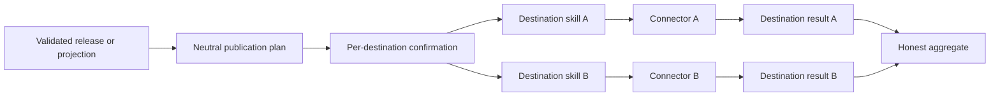

## Context

Publishing to GitHub, NotebookLM, Firebase, and future destinations shares release authority and
disclosure policy but differs in credentials, payloads, visibility, retries, and reversibility. A
single skill cannot scale without accumulating vendor branches.

## Goals / Non-Goals

**Goals:** one entry point; dynamic leaf discovery; exact-byte plans; per-destination confirmation;
independent execution; honest aggregate state; connector isolation.

**Non-goals:** vendor API calls in the parent, credential handling, automatic fallback, or deletion.

## Decisions

### Decision: use the ADR-0019 three-level tree

The parent owns neutral planning. Each leaf owns one destination workflow. A connector owns API
translation. Vendor names occur only in leaves and adapters, never Publication domain records.

### Decision: confirmation is per destination

Every plan specifies exact bytes, identifier, visibility, operation, conflict behaviour, and
retraction limits. The child is invoked only after action-time confirmation for that destination.

### Decision: aggregate state does not flatten child truth

Children report planned, attempted, accepted, uploaded, and observed visibility separately. Partial
success is normal; no failure triggers an unapproved fallback or rollback elsewhere.

## Risks / Trade-offs

- **Parent still gains vendor branches** → capability discovery and opaque child records.
- **One approval leaks to all destinations** → explicit per-destination confirmation state.
- **Accepted request is called published** → preserve upload and observed visibility states.
- **Partial success triggers unsafe recovery** → independent idempotency and no automatic fallback.

## Validation

Validate ADR traceability, Mermaid architecture, skill and plugin structure, installer discovery,
bundle contents, strict OpenSpec, and the complete repository. Complete one quick review before archive.
