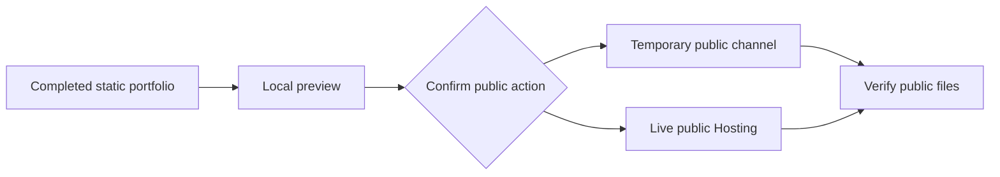

## Context

Firebase Hosting preview and live URLs are public. A temporary or obscure preview URL is not access
control, and live deployment must not reuse earlier preview consent.

## Decisions

### Decision: publish completed static bytes only

The leaf receives the offline portfolio manifest and root. It never reads canonical knowledge or adds
Firebase runtime code, which keeps hosted output equivalent to the reviewed local projection.

### Decision: public is the only supported Hosting visibility

Private or restricted sharing fails closed. An authenticated application would be a separately
designed projection and connector, not an option hidden inside this leaf.

### Decision: local, preview-channel, and live are distinct

Local preview is non-public. Preview channels and live are separately confirmed public mutations.
Remote acceptance, asset verification, and observed reachability remain separate result states.

## Validation

Run skill, plugin, installer, package, strict OpenSpec, intent-link checks, and one quick review.
