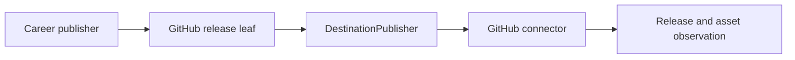

## Context

GitHub separates releases, tags, and assets and can partially succeed. Published visibility follows
repository access, so generic audience requests must be checked before mutation.

## Decisions

### Decision: GitHub is a leaf and adapter

The parent supplies an exact confirmed plan. The leaf owns GitHub workflow semantics. A connector owns
authentication and API translation behind Publication ports.

### Decision: conflicts fail closed

Draft is the default. Existing tags, releases, or same-named assets must match the planned identity or
produce `conflict`; replacement is a distinct confirmed operation.

### Decision: verify every asset independently

Release creation, asset upload, digest equivalence, and observed visibility are recorded separately so
partial success cannot be presented as publication.

## Validation

Run skill and plugin validation, installer discovery, package tests, strict OpenSpec, and one quick
review before archive.
