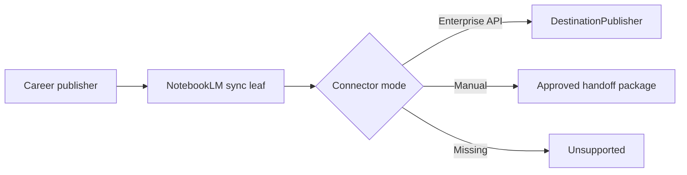

## Context

Gemini Notebook Enterprise exposes preview notebook/source APIs, while consumer NotebookLM must not be
assumed to expose the same capability. Source copies and sharing also have different lifecycles.

## Decisions

### Decision: capability mode is explicit

The leaf records Enterprise API, manual handoff, or unsupported. Only a compatible connector can claim
remote synchronisation.

### Decision: append safely before replacement

Exact matches are reused and mismatches conflict. Replacement adds and verifies the new source before
any separately confirmed deletion because remote source updates need not be atomic.

### Decision: synchronisation cannot change sharing

Source receipt, processing, and observed notebook visibility remain distinct. Generated NotebookLM
outputs stay external projections rather than canonical claims.

## Validation

Run skill, plugin, installer, package, strict OpenSpec, intent-link checks, and one quick review.
