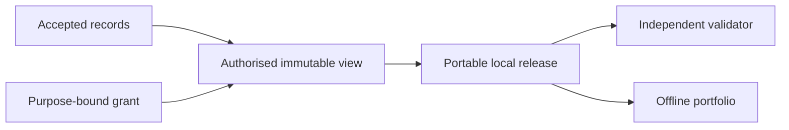

## Context

Accepted entities already exist in SQLite. Publication must never query that database directly; an
authorised immutable view is the hand-off boundary.

## Decisions

### Decision: one operation issues the grant and freezes the view

The caller supplies purpose, audience, expiry, allowed labels, reviewer, and confirmation. Person
Knowledge filters accepted entities and their admission activities, sorts them by stable ID, assigns a
monotonic view version, and stores the complete snapshot atomically.

### Decision: the release is deterministic and content-addressed

Publication serialises sorted NDJSON, hashes every file, then writes the manifest last into a temporary
directory renamed atomically. The release ID derives from the view identity and payload digest. A
validator reads only the bundle and fails on schema, path, digest, count, or JSON errors.

### Decision: limitations are part of the output

The current runtime releases accepted entities and admission activities. Claims, evidence, and aliases
are empty until their admission paths exist; the manifest states this instead of implying coverage.

## Validation

Test expiry, label filtering, idempotency, atomic output, deterministic bytes, tamper detection, CLI
preview/confirmation, architecture boundaries, and strict OpenSpec before archive.
