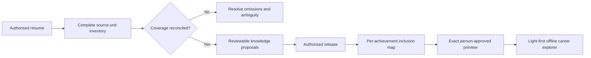

## Context

The failure is a pipeline-ordering problem: the source was summarised into preferred stories before
all its substantive units had a recorded disposition. The renderer then had neither the data nor the
selection audit needed to expose omissions.

## Decisions

### Reconcile extraction before selection

Each source unit receives a stable identifier, locator, faithful meaning, engagement context, and
exactly one disposition. Compound units may resolve into child units, but every child is reconciled.

### Make portfolio selection total

Every authorised Work, Contribution, and reported outcome receives exactly one inclusion decision.
Generation fails when a decision is missing, duplicated, invalid, or deferred.

### Treat the portfolio as a career record, not a landing-page advertisement

The default view uses a restrained light visual system, a structured achievement index, contextual
record detail, and an interactive relationship graph. The graph exposes only real release
relationships, has a complete text equivalent, and never truncates records silently.

## Risks / Trade-offs

- More source units require more review, mitigated by stable grouping and explicit counts.
- Sparse releases cannot support rich narratives, so the renderer labels gaps instead of inventing
  them.
- Interactive static output adds local CSS and JavaScript files, kept deterministic and CSP-bound.
