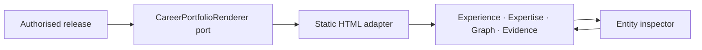

# Design

## Projection boundary

Publication continues to consume only a validated immutable release. The static renderer constructs a replaceable read model of entities and explicit claims; it does not change semantic knowledge.

## Entity navigation

Each rendered entity receives a fragment URL containing its stable release record ID. A small explicit explore control opens the wide side navigator; ordinary row selection remains ordinary. The same URL supports direct navigation. In the graph, click changes focus while double-click, right-click, long-press, or keyboard activation opens the navigator. The inspector lists only explicit inbound and outbound claim relationships, includes a return-to-focused-graph control, and supports repeated traversal with local history.

Technology views traverse explicit claim relationships, including intermediate TechnologyUse entities, instead of inferring expertise from prose. When no relationship exists, the renderer states the limitation.

The light, compact presentation is governed by a versioned machine-readable template contract and
exercised by fictional sample data through the production renderer. `featured` is the only semantic
status that receives a faint highlight; the renderer does not guess which records deserve emphasis.

## Résumé length

`ResumeLength` is a projection option with `one-page`, `two-pages`, `three-pages`, and `complete`. It is shown during preview and included in the deterministic projection identity. The coordinating skill asks the person before approval; the CLI defaults to `complete` only for backward compatibility and reports that value.

## Affected boundaries

- Domain/application: projection option and preview result.
- Inbound CLI adapter: `--resume-length` parsing.
- Outbound static renderer: compact lenses, deep links, focused graph, and print rules.
- Skill/record contract: preview question and recorded choice.
